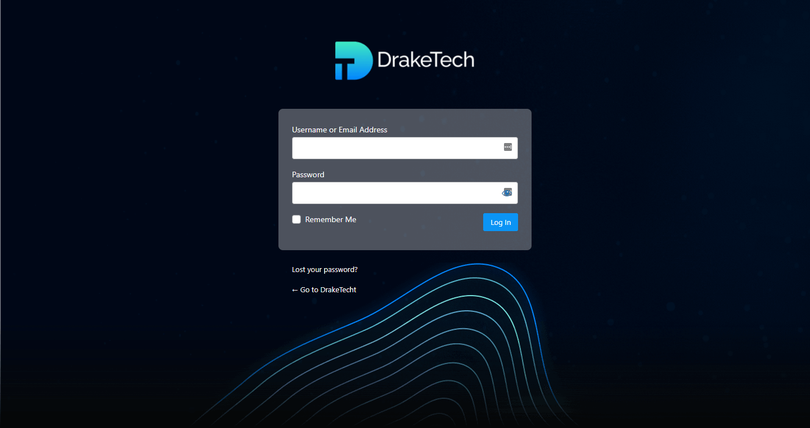
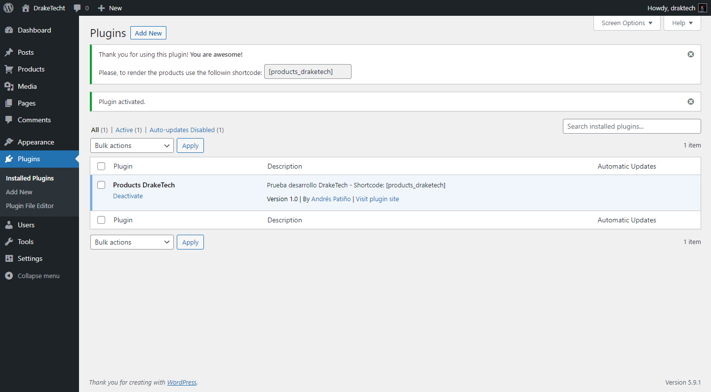
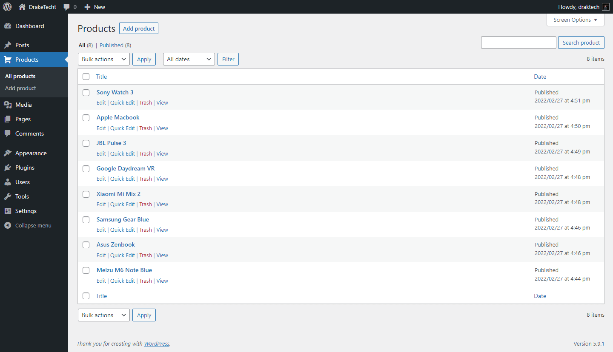
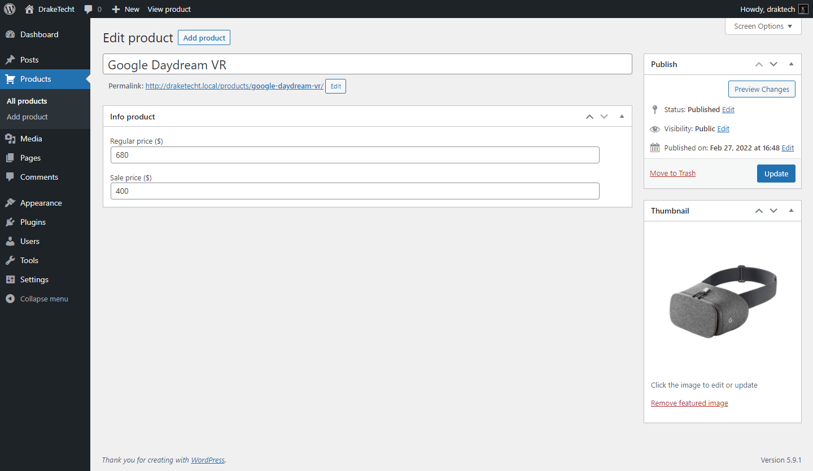

# DrakeTech WordPress test

## General description
* For the landing page I created a custom page template called "Ecommerce page" which should be chosen as a template on any page of the dashboard. 
* The content of the landing page is static, all in HTML. 
Except for the product slider which is built with the "Products DrakeTech" plugin. Which provides us with a shortcode `[products_draketech]` that can be used anywhere. 
* When activating the plugin in the side menu appears a new custom post type called "Products" where you can create, edit, delete new products. (You must enter for each product a name, price and image).
* Remember, after creating the products you can display them using the shortcode mentioned above. 

### Shortcode plugin

```
[products_draketech]
```

## Screenshots 







